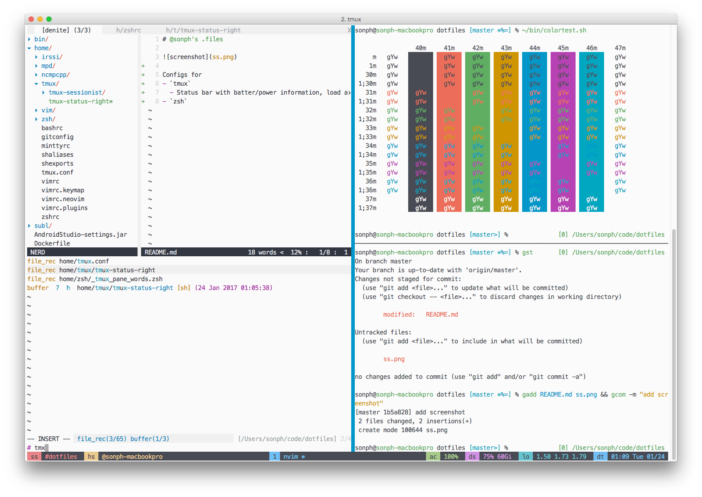

# @sonph's .files

[](https://travis-ci.org/sonph/dotfiles)



## Installation

linux

```
sudo apt-get update
ping github.com
git clone https://github.com/sonph/dotfiles ~/.files
~/.files/linux-install.sh group-cli-install  # essential cli stuffs
~/.files/linux-install.sh group-gui-install  # gui stuffs
```

mac

```
TODO
```
